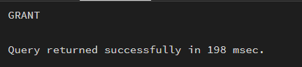
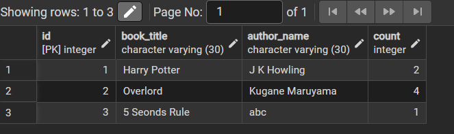
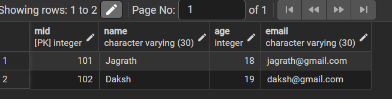
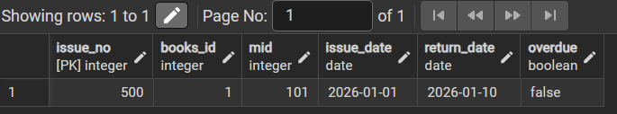
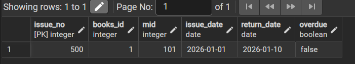
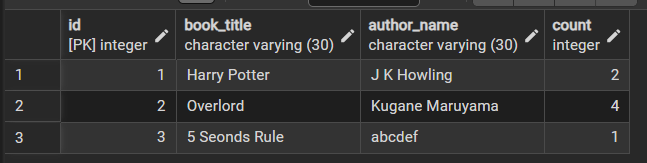
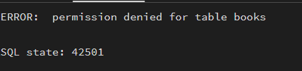

## AIM
To design and implement a Library Management System database using appropriate tables, primary keys, foreign keys, and constraints, and to perform DML operations along with DCL commands such as role creation, privilege granting, and revoking to ensure database security.

## Software Requirements
- **Database Management System:** PostgreSQL
- **Database Administration Tool:** pgAdmin

## Objective
To gain practical experience in implementing Data Definition Language (DDL), Data Manipulation Language (DML), and Data Control Language (DCL) operations in a real database environment, including role-based privilege management.

## Practical / Experimental Steps
1. Open pgAdmin and connect to the PostgreSQL server using administrator credentials.
2. Create the Books table with appropriate data types, primary key, and constraints.
3. Insert sample records into the Books table and perform SELECT, UPDATE, and DELETE operations.
4. Create the Members table with primary key, NOT NULL, UNIQUE, and CHECK constraints.
5. Create the Books_Issue table with primary key and foreign key references.
6. Insert sample book issue records and verify using SELECT queries.
7. Create a database role named Librarian with LOGIN and password.
8. Grant SELECT, INSERT, UPDATE, and DELETE permissions to the Librarian role.
9. Revoke permissions to demonstrate database security.

## Database Design

### Create Table: Books
```sql
CREATE TABLE Books (
    ID INT PRIMARY KEY,
    Book_Title VARCHAR(30),
    Author_Name VARCHAR(30),
    Count INT CHECK (Count >= 1) NOT NULL
);
```

### Create Table: Members
```sql
CREATE TABLE Members (
    MID INT PRIMARY KEY,
    Name VARCHAR(30) NOT NULL,
    Age INT CHECK (Age >= 16) NOT NULL,
    Email VARCHAR(30) UNIQUE NOT NULL
);
```

### Create Table: Books_Issue
```sql
CREATE TABLE Books_Issue (
    Issue_No INT PRIMARY KEY,
    Books_ID INT REFERENCES Books(ID) NOT NULL,
    MID INT REFERENCES Members(MID) NOT NULL,
    Issue_Date DATE NOT NULL,
    Return_Date DATE CHECK (Issue_Date <= Return_Date OR Return_Date IS NULL),
    Overdue BOOLEAN NOT NULL DEFAULT FALSE
);
```

## Role Management

### Create Role
```sql
CREATE ROLE Librarian
WITH LOGIN PASSWORD '123';
```

### Grant Permissions
```sql
GRANT SELECT, INSERT, UPDATE, DELETE ON Books TO Librarian;
GRANT SELECT, INSERT, UPDATE, DELETE ON Members TO Librarian;
GRANT SELECT, INSERT, UPDATE, DELETE ON Books_Issue TO Librarian;
```


## Data Manipulation

### Insert Records
```sql
INSERT INTO Books (ID, Book_Title, Author_Name, Count)
VALUES
(1, 'Harry Potter', 'J K Howling', 2),
(2, 'Overlord', 'Kugane Maruyama', 4),
(3, '5 Second Rule', 'abc', 1);
```

```sql
INSERT INTO Members (MID, Name, Age, Email)
VALUES
(101, 'Jagrath', 18, 'jagrath@gmail.com'),
(102, 'Daksh', 19, 'daksh@gmail.com');
```

```sql
INSERT INTO Books_Issue (Issue_No, Books_ID, MID, Issue_Date, Return_Date)
VALUES
(500, 1, 101, '2026-01-01', '2026-01-10');
```

### Accessing Data Using Created Role (Librarian)
```sql
select * from books;
select * from members;
select * from books_Issue;
```

```sql
UPDATE books
set author_name = 'abcdef' where id=3
```

## Revoke Permissions
```sql
REVOKE SELECT, INSERT, UPDATE, DELETE ON Books FROM Librarian;
REVOKE SELECT, INSERT, UPDATE, DELETE ON Members FROM Librarian;
REVOKE SELECT, INSERT, UPDATE, DELETE ON Books_Issue FROM Librarian;
```


## Learning Outcomes
- Understood relational database design principles.
- Applied primary and foreign key constraints.
- Practiced DDL, DML, and DCL commands.
- Implemented role-based access control.
- Gained hands-on PostgreSQL experience.
