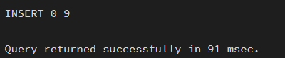
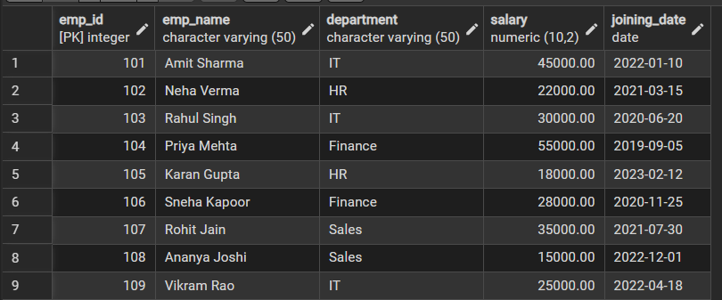
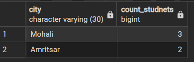
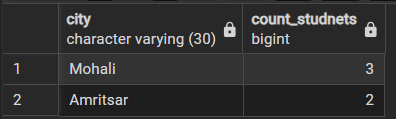
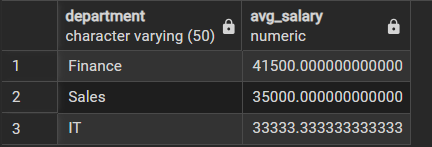
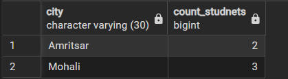

## Aim of the Practical
To understand and implement SQL SELECT queries using various clauses such as WHERE, ORDER BY, GROUP BY, and HAVING to retrieve and manipulate data efficiently from relational database tables.

## Tool Used

### Database Management System
- PostgreSQL

### Database Administration Tool
- pgAdmin

## Objective
- To practice writing SQL SELECT statements.
- To apply filtering conditions using the WHERE clause.
- To sort query results using the ORDER BY clause.
- To group records using the GROUP BY clause.
- To filter grouped data using the HAVING clause.
- To analyze data using aggregate functions like COUNT(), SUM(), AVG(), MIN(), and MAX().

## Practical / Experimental Steps

1. Start the system and log in to the computer.
2. Open pgAdmin (PostgreSQL).
3. Create or select the required database (e.g., lab_db).
4. Create the EMPLOYEE table using the given schema.
5. Insert sample data into the EMPLOYEE table.
6. Execute the queries step-by-step according to the practical steps.
7. Verify the output after each query execution.
8. Capture screenshots of execution and results for record.
9. Save the work and upload worksheet (Word + PDF) on GitHub.

## I / O Analysis

### Database Design

#### Create Table: employee
```sql
CREATE TABLE employee (
    emp_id       INT PRIMARY KEY,
    emp_name     VARCHAR(50),
    department   VARCHAR(50),
    salary       NUMERIC(10,2),
    joining_date DATE
);
```

#### Insert Records
```sql
INSERT INTO employee (emp_id, emp_name, department, salary, joining_date) VALUES
(101, 'Amit Sharma',   'IT',        45000, '2022-01-10'),
(102, 'Neha Verma',    'HR',        22000, '2021-03-15'),
(103, 'Rahul Singh',   'IT',        30000, '2020-06-20'),
(104, 'Priya Mehta',   'Finance',   55000, '2019-09-05'),
(105, 'Karan Gupta',   'HR',        18000, '2023-02-12'),
(106, 'Sneha Kapoor',  'Finance',   28000, '2020-11-25'),
(107, 'Rohit Jain',    'Sales',     35000, '2021-07-30'),
(108, 'Ananya Joshi',  'Sales',     15000, '2022-12-01'),
(109, 'Vikram Rao',    'IT',        25000, '2022-04-18');
```


## Display the Table
```sql
SELECT * FROM employee;
```


## Group By and Aggregate Queries
```sql
SELECT department, AVG(salary) AS avg_salary
FROM employee
GROUP BY department;
```


```sql
SELECT department, AVG(salary) AS avg_salary
FROM employee
WHERE salary > 20000
GROUP BY department;
```


```sql
SELECT department, AVG(salary) AS avg_salary
FROM employee
WHERE salary > 20000
GROUP BY department
HAVING AVG(salary) > 30000;
```


```sql
SELECT department, AVG(salary) AS avg_salary
FROM employee
WHERE salary > 20000
GROUP BY department
HAVING AVG(salary) > 30000
ORDER BY avg_salary DESC;
```


## Learning Outcomes
- Understood the syntax and usage of SQL SELECT statements.
- Gained practical knowledge of WHERE clause for filtering rows.
- Learned grouping operations using GROUP BY clause.
- Applied HAVING clause to filter grouped results.
- Sorted query outputs using ORDER BY clause.
- Got hands-on experience in PostgreSQL execution using PgAdmin.
