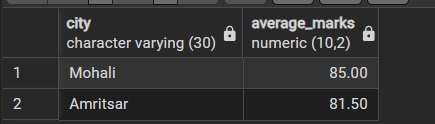
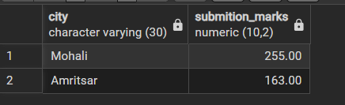
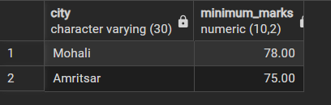
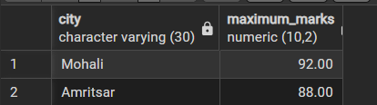

## Aim of the Practical
To understand and implement SQL SELECT queries using various clauses such as WHERE, ORDER BY, GROUP BY, and HAVING to retrieve and manipulate data efficiently from relational database tables.

## Tool Used

### Database Management System
- PostgreSQL

### Database Administration Tool
- pgAdmin

## Objective
- To practice writing SQL SELECT statements.
- To apply filtering conditions using the WHERE clause.
- To sort query results using the ORDER BY clause.
- To group records using the GROUP BY clause.
- To filter grouped data using the HAVING clause.
- To analyze data using aggregate functions like COUNT(), SUM(), AVG(), MIN(), and MAX().

## Practical / Experimental Steps

1. Open pgAdmin / SQL shell and connect to the PostgreSQL database.
2. Create the Students table with appropriate columns and data types.
3. Insert sample student records containing id, name, city, and marks.
4. Use the COUNT() function with GROUP BY city to find the number of students in each city.
5. Apply ORDER BY on the aggregated COUNT result to sort cities based on student count.
6. Use the HAVING clause to filter cities having at least a specified number of students.
7. Use the AVG() function with GROUP BY city to calculate the average marks of students in each city.
8. Execute aggregation functions such as SUM(), MIN(), and MAX() to analyze student marks.
9. Verify the output of each query to understand grouping and aggregation behavior in SQL.

## I / O Analysis

### Database Design

#### Create Table: Students
```sql
CREATE TABLE Students (
    id NUMERIC(10,0) PRIMARY KEY,
    name VARCHAR(50),
    city VARCHAR(30),
    marks NUMERIC(10,0)
);
```

#### Insert Records
```sql
INSERT INTO Students VALUES (1, 'Aman', 'Mohali', 85);
INSERT INTO Students VALUES (2, 'Rohit', 'Mohali', 78);
INSERT INTO Students VALUES (3, 'Neha', 'Mohali', 92);
INSERT INTO Students VALUES (4, 'Simran', 'Amritsar', 88);
INSERT INTO Students VALUES (5, 'Karan', 'Amritsar', 75);
```


## Group By and Aggregate Queries

```sql
SELECT CITY, COUNT(*) AS COUNT_STUDENTS
FROM STUDENTS
GROUP BY CITY;
```


```sql
SELECT CITY, COUNT(ID) AS COUNT_STUDENTS
FROM STUDENTS
GROUP BY CITY;
```


```sql
SELECT CITY, COUNT(ID) AS COUNT_STUDENTS
FROM STUDENTS
GROUP BY CITY
ORDER BY COUNT_STUDENTS ASC;
```


```sql
SELECT CITY, COUNT(*) AS COUNT_STUDENTS
FROM STUDENTS
GROUP BY CITY
ORDER BY COUNT(*) ASC;
```


```sql
SELECT CITY, COUNT(ID) AS COUNT_STUDENTS
FROM STUDENTS
GROUP BY CITY
HAVING COUNT(ID) >= 3;
```


```sql
SELECT CITY, AVG(MARKS)::NUMERIC(10,2) AS AVERAGE_MARKS
FROM STUDENTS
GROUP BY CITY;
```


```sql
SELECT CITY, SUM(MARKS)::NUMERIC(10,2) AS SUBMISSION_MARKS
FROM STUDENTS
GROUP BY CITY;
```


```sql
SELECT CITY, MIN(MARKS)::NUMERIC(10,2) AS MINIMUM_MARKS
FROM STUDENTS
GROUP BY CITY;
```


```sql
SELECT CITY, MAX(MARKS)::NUMERIC(10,2) AS MAXIMUM_MARKS
FROM STUDENTS
GROUP BY CITY;
```


## Learning Outcomes
- Understood database table creation using appropriate data types and primary keys.
- Gained practical knowledge of SQL aggregate functions such as COUNT, SUM, AVG, MIN, and MAX.
- Learned to use GROUP BY and HAVING clauses for grouped data filtering.
- Developed skills to analyze and summarize data using ORDER BY.
- Acquired hands-on experience in writing and executing SQL SELECT queries in PostgreSQL.
