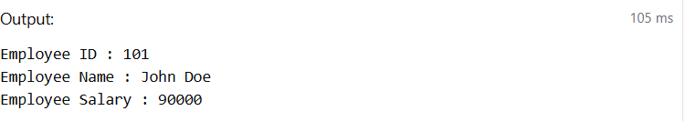

## Aim of the Practical

To understand the basic structure of a PL/SQL program by creating and
executing a simple PL/SQL block that includes declaration and execution
sections, and to display output using built-in procedures.

## Tool Used

### Database Management System

-   Oracle Database

### Database Administration Tool

-   Oracle SQL\*Plus / SQL Developer

## Objective

-   To create a simple PL/SQL program demonstrating Declaration Section
    and Execution Section.
-   To declare and initialize variables in PL/SQL blocks.
-   To display output using DBMS_OUTPUT.PUT_LINE.
-   To perform basic mathematical operations and conditional logic in
    PL/SQL.

## Practical / Experimental Steps

1.  Open Oracle SQL\*Plus / SQL Developer and create a new SQL
    worksheet.
2.  Enable output display using the command: `SET SERVEROUTPUT ON`.
3.  Write the first PL/SQL block with a DECLARE section to define
    employee variables.
4.  Execute the block using BEGIN...END and display values using
    DBMS_OUTPUT.PUT_LINE.
5.  Run the second and third blocks to perform salary calculations and
    conditional tax bracket checks.
6.  Observe and verify the output results shown in the output window for
    each PL/SQL block execution.

## I / O Analysis

### PL/SQL Block 1: Employee Details

``` sql
DECLARE
    emp_id     NUMBER := 101;
    emp_name   VARCHAR2(50) := 'John Doe';
    emp_salary NUMBER := 90000;
    result NUMBER;
BEGIN
    DBMS_OUTPUT.PUT_LINE('Employee ID : ' || emp_id);
    DBMS_OUTPUT.PUT_LINE('Employee Name : ' || emp_name);
    DBMS_OUTPUT.PUT_LINE('Employee Salary : ' || emp_salary);
    result := emp_salary * 0.01;
  DBMS_OUTPUT.PUT_LINE('10% of salary :'|| result);
END;
/

```


## Learning Outcomes

-   Understood the basic structure of a PL/SQL block, including the
    DECLARE and BEGIN...END sections.
-   Learned how to declare and initialize variables for storing data
    values.
-   Gained knowledge of using DBMS_OUTPUT.PUT_LINE to display results
    during program execution.
-   Practiced performing mathematical operations on variables within
    PL/SQL programs.
-   Developed understanding of decision-making using IF--ELSIF--ELSE
    conditional statements.
-   Acquired practical insight into how PL/SQL can be used for simple
    database-related computations and logic implementation.
